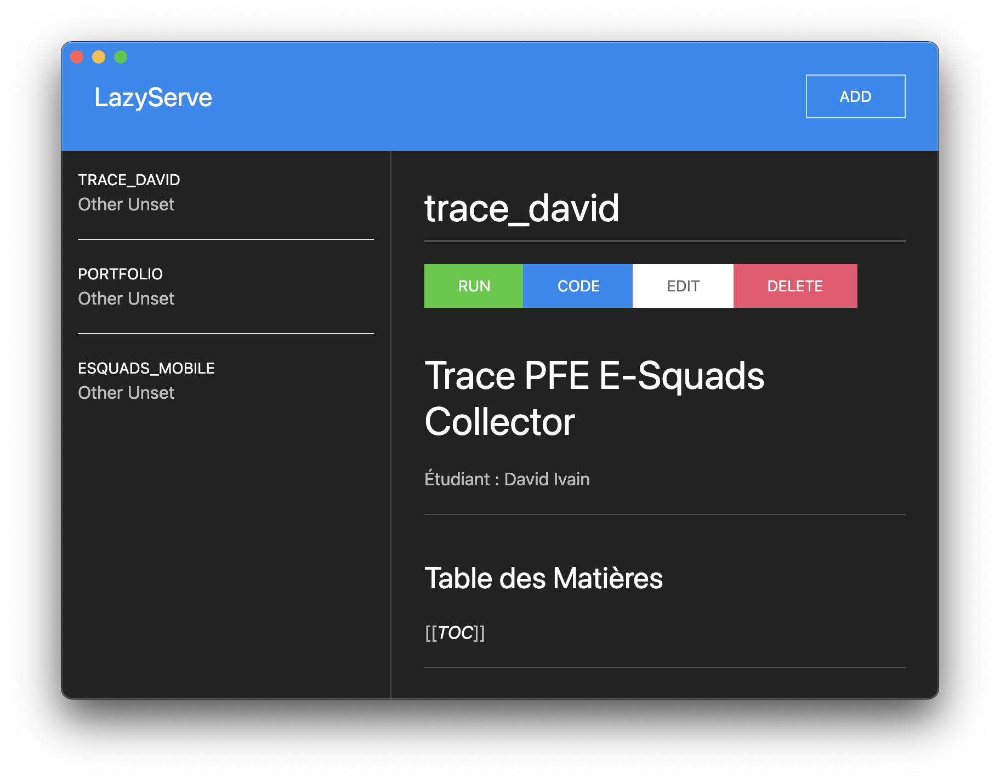

# LazyServe (WIP)

Originally aimed to be a nexus where I could reference and launch all my node projects, but I might add more to it.

Made with [React](https://reactjs.org), [Electron](https://www.electronjs.org) and [TypeScript](https://www.typescriptlang.org) using [Electron Forge](https://www.electronforge.io). Additional dependencies include [Nedb](https://github.com/louischatriot/nedb), [React Markdown](https://github.com/remarkjs/react-markdown), [React Syntax Highlighter](https://github.com/react-syntax-highlighter/react-syntax-highlighter) and [UIKit](https://getuikit.com).